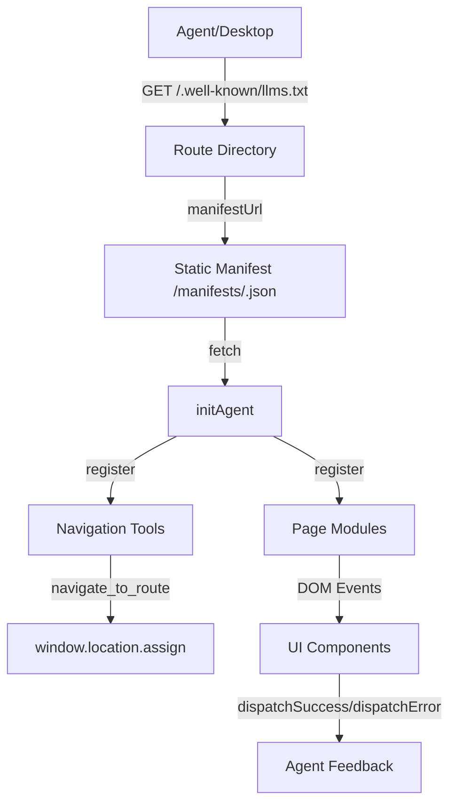

# Agentic Website Blueprint

A reference implementation of an agent-friendly, multi-page Next.js application.  
Every page publishes its own manifest of tools, so LLM-based agents know exactly what operations are available in any given route. The UI stays human-first, while agents get deterministic, auditable controls.

---

## ✨ Highlights

- **Page-scoped manifests**: static JSON contracts per route (`/manifests/<page>.json`).
- **Global navigation manifest**: a dedicated `/manifests/navigation.json` so agents can move between pages intentionally.
- **Event-driven tools**: DOM events provide a consistent API surface for agents (`contact_form_fill`, `dashboard_filter_apply`, etc.).
- **Agent-aware runtime**: `public/js/agentic-handler.js` loads manifests, registers tools, and keeps the UI and agent contracts in sync.

---

## 🚀 Getting Started

### Prerequisites

- Node.js 18+ (or the latest Active LTS release)
- npm 9+

### Installation

```bash
git clone https://github.com/<your-org>/agentic-website.git
cd agentic-website
npm install
```

### Development

```bash
npm run dev
```

- App: http://localhost:3000  
- HMR enabled

### Static Export

```bash
npm run export
```

Exports the site to the `build/` directory (configured via `next.config.mjs`).

---

## 📁 Project Structure

```
agentic-website/
├─ components/               # Reusable React components
│  ├─ analytics/             # Analytics dashboard widgets
│  ├─ consultations/         # Consultation booking UI
│  ├─ docs/                  # Knowledge base components
│  └─ support/               # Ticketing workspace pieces
├─ pages/                    # Next.js routes
│  ├─ index.js               # Home / commerce hub
│  ├─ consultations/index.js
│  ├─ analytics/index.js
│  ├─ docs/index.js
│  └─ support/index.js
├─ public/
│  ├─ .well-known/llms.txt   # Directory card for agents
│  ├─ manifests/             # Static manifests per route
│  ├─ js/modules/            # Tool binding modules
│  └─ js/tools/              # Per-page bootstrap scripts
├─ public/js/agentic-handler.js
├─ styles/globals.css
├─ __tests__/                # Jest + Testing Library suites
└─ README.md
```

---

## 🧠 Architecture Deep Dive

| Layer | Purpose |
|-------|---------|
| `public/.well-known/llms.txt` | Directory document. Lists every route, describes the navigation manifest, and links to each static manifest. |
| `public/manifests/*.json` | Page-scoped contracts. Agents fetch these to discover the tools available on a page. `navigation.json` defines `navigate_to_route`. |
| `public/js/agentic-handler.js` | Runtime that loads manifests, registers handlers, and ensures tools fire only when the correct page is active. |
| `public/js/modules/*.js` | DOM bindings. Each function wires tool events (`dispatchSuccess`, `dispatchError`) to actual UI behavior. |
| `public/js/tools/*.tools.js` | Bootstrap scripts. Fetch the manifest, call `initAgent`, and register the relevant modules (including navigation). |

### Tool Lifecycle

1. Agent visits a page → fetches `/.well-known/llms.txt`.
2. Manifest URL is loaded (e.g., `/manifests/consultations.json`).
3. `initAgent` registers the page’s bindings and the global navigation bindings.
4. When a tool event is fired, the module performs the UI action and emits success/error events with metadata.

### Navigation Workflow

- Agents fetch `/manifests/navigation.json` when they need to switch pages.
- `registerNavigationTools` handles `navigate_to_route`, mapping `pageId` or `path` to the correct URL and calling `window.location.assign`.
- Guards in `agentic-handler.js` ensure that if an agent fires a page-specific tool from the wrong route, the UI redirects first.



---

## 🧩 Page Capabilities

| Route | Highlights | Primary Tools |
|-------|------------|---------------|
| `/` (Home) | Hero showcase, featured products, quick contact, cart | `featured_product_highlight`, `quick_contact_fill`, `quick_contact_fill_submit`, plus search/cart helpers |
| `/consultations` | Booking form, availability picker, FAQ accordion | `consultation_form_fill`, `consultation_form_submit`, `faq_reveal` |
| `/analytics` | KPI cards, filters, timeline, session table | `dashboard_filter_apply`, `session_detail_focus`, `export_insights` |
| `/docs` | Knowledge base, playbooks, glossary, training CTA | `doc_section_focus`, `playbook_expand`, `training_request_fill` |
| `/support` | Ticket inbox, conversation view, canned responses, checklist | `ticket_select`, `response_compose_send`, `resolution_checklist_update` |

Each tool covers a complete intent—no per-input micromanagement—so agents can reason at task granularity.

---

## ✅ Testing

Run the unit suite (Jest + Testing Library):

```bash
npm test
```

- Page tests confirm components render and key controls exist.
- Extend with integration or Playwright tests as you wire in backend APIs.

---

## 🛠️ Extending the Blueprint

1. **Add a route**  
   - Create `components/<page>/` and `pages/<page>/index.js`.  
   - Add `public/manifests/<page>.json` describing the tools.  
   - Create bindings in `public/js/modules/<page>-tools.js`.  
   - Add `public/js/tools/<page>.tools.js` to fetch the manifest and call `initAgent` (don’t forget `registerNavigationTools`).  
   - Append the new route to `/.well-known/llms.txt` and the navigation manifest.

2. **Add a tool to an existing page**  
   - Update the page manifest with the new tool definition.  
   - Extend the module to handle the DOM action and emit success/error events.  
   - Write or update tests in `__tests__/`.

3. **Integrate a backend**  
   - Current forms mimic submissions client-side. Replace `console.log` stubs with real API calls as needed.  
   - Maintain the same event signatures so agents remain compatible.

---

## 🤝 Contributing & Feedback

Issues, ideas, or improvements? Open an issue or PR, or reach out directly. This is meant to be a living reference for anyone building agent-ready front ends.

---

## 📜 License

MIT — see [LICENSE](./LICENSE) for details.

Enjoy building agent-capable experiences! 💡

